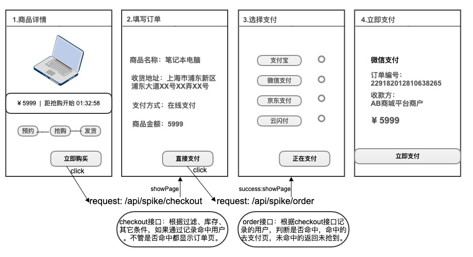
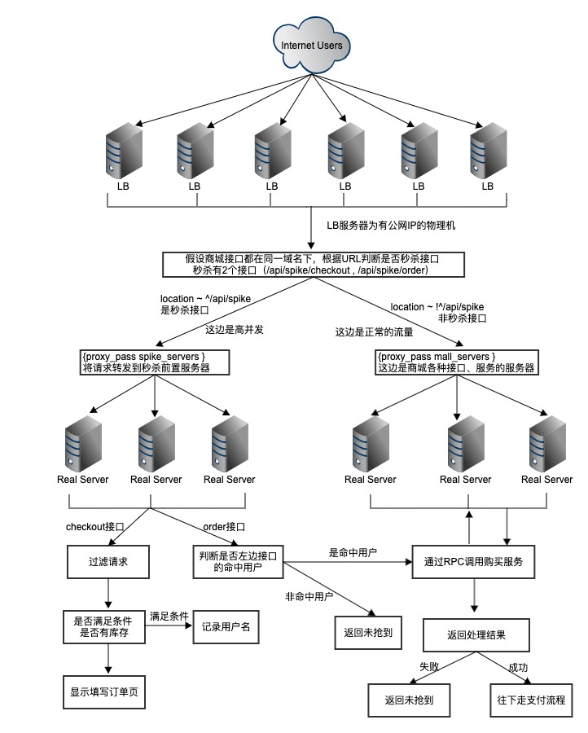

# 高并发秒杀设计方案

## 设计思路

* 防刷设计
    * 设计有效的防刷机制，避免恶意请求调用接口。

* 分层校验
    * 鉴于只有少部分用户能够秒杀成功，尽可能在不同层将无效请求拦截并过滤掉，让真正有效的请求落入后端服务。

* 异步处理
    * 使用队列，采用异步模式提高系统并发量。

* 使用缓存
    * 数据库读写属于磁盘IO性能很低，尽可能的把数据转移到缓存来处理，极大地提升效率。

* 动静分离
    * 将静态资源进行CDN缓存，减少后端服务器的压力。

* 前端控制
    * 秒杀开始前按钮置灰不可点，秒杀开始用户点击后置灰几秒避免重复点击。
    * 如果服务器压力实在太大，用户点击按钮后，判断活动开始距今是否已经超过N秒钟，超过的用户直接返回失败。或者随机提示一部分用户网络繁忙。

* 可拓展
    * 如果我们想支持更多用户，更大的并发，最好将系统设计成弹性可拓展的，如果流量迅速增大，下次拓展机器即可。

##  业务场景

有个商品库存有10000个，活动开始前需要预约，预约成功的用户才有资格购买，预约人数上限为100万。  
假设已经做好防刷、限流等措施，重点在于如何处理真实的用户请求。后端以最大100万的流量来架构设计。

秒杀流程图  

## 设计方案

### 需解决问题

* 如何防止商品超卖
* 保护原有服务不受秒杀活动影响甚至挂机
* URL动态化防止提前暴露被刷，但是如何刷新呢，前端获取刷新地址还是会暴露
* 使用队列异步处理，如何知道抢购结果，如何使流程继续走下去，不影响用户体验

### 服务器架构

#### 域名和LB服务器
秒杀接口的域名要么和其它接口共用域名，要么使用单独的新域名

共用域名就是使用原域名所绑定的LB服务器，如果现有LB服务器扛不住秒杀的流量，那么按照现有的服务器环境扩展机器数量。优点是维护成本低，如果其它业务流量增长，那么增加的机器还是可以利用。缺点是不隔离各服务会互相影响。

单独域名就是重新为秒杀域名搭建LB服务器，但是环境基本和原LB类似。优点是和其它域名隔离，至少在LB层不会影响其它服务。缺点是增加维护成本，没秒杀的时候资源闲置。

2种方式都可行，个人采用共用域名的方式。根据经验，LB服务器都是物理机，做的事情也很简单，抗压能力比较强，不会那么容易挂。

#### LB服务器将请求指向哪里

要么直接指向后端真实服务器来处理，要么加个中间层，中间层处理完之后确定是否结束还是继续请求后端真实服务器

这里当然使用中间层来预处理，如果没有中间层，那么所有流量都会指向后端服务器，后端服务器虽然也可以做拦截过滤，但是风险比较大。并且后端服务器拥有众多服务，如果单独把秒杀业务剥离出来部署会增加开发运维成本。要吞吐这么大的流量肯定要扩展机器，不管后端秒杀服务是否独立，扩展部署这些复杂的服务成本肯定不低。

所以，增加秒杀服务前置服务器，做秒杀请求的拦截过滤等简单操作当中间层来应对大流量，把少量请求传到后端服务器。后端服务器如果处理不了库存总量的请求，那适当扩展机器，这个数量不会太多。  
如果不用这个中间层，后端服务的每次修改由于都在一起业务复杂面临很大的风险，定位修复问题也不易，而中间层逻辑简单易测试风险小，扩展服务器也容易。

#### 后端服务器

经过前置服务器的拦截过滤，后端服务器的流量已经很小了，但是相对平时的流量还是大很多，主要是并发高。这可以根据当前服务器的处理能力，适当扩展后端服务器。

### 秒杀架构图

