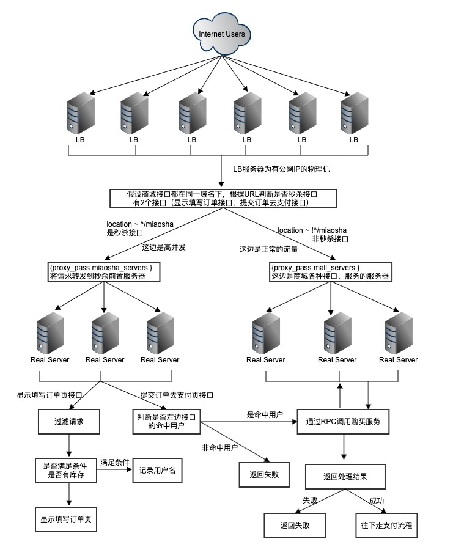

# 高并发秒杀设计方案

## 设计思路

* 防刷设计
    * 设计有效的防刷机制，避免恶意请求调用接口。

* 分层校验
    * 鉴于只有少部分用户能够秒杀成功，尽可能在不同层将无效请求拦截并过滤掉，让真正有效的请求落入后端服务。

* 异步处理
    * 使用队列，采用异步模式提高系统并发量。

* 使用缓存
    * 数据库读写属于磁盘IO性能很低，尽可能的把数据转移到缓存来处理，极大地提升效率。

* 动静分离
    * 将静态资源进行CDN缓存，减少后端服务器的压力。

* 前端控制
    * 秒杀开始前按钮置灰不可点，秒杀开始用户点击后置灰几秒避免重复点击。
    * 如果服务器压力实在太大，用户点击按钮后，判断活动开始距今是否已经超过N秒钟，超过的用户直接返回失败。或者随机提示一部分用户网络繁忙。

* 可拓展
    * 如果我们想支持更多用户，更大的并发，最好将系统设计成弹性可拓展的，如果流量迅速增大，下次拓展机器即可。

##  业务场景

有个商品库存有10000个，活动开始前需要预约，预约成功的用户才有资格购买，预约人数上限为100万。  
假设已经做好防刷、限流等措施，重点在于如何处理真实的用户请求。后端以最大100万的流量来架构设计。

秒杀流程图  

## 设计方案

### 服务器架构

#### 服务器架构图  

#### 服务器架构说明

##### 服务隔离
秒杀的特点就是瞬间大流量高并发。通常系统的各个服务都是相互依赖，关系错综复杂。一个服务挂了，其它服务可能也会受到影响。因此，需要把前端接收大流量的服务单独剥离出来，一旦前端服务挂了，不会穿透到后端影响后端服务。  
同时，秒杀也是一个普通的购买操作，大部分业务逻辑都和正常的购买流程差不多，依赖普通购买服务。  
因此，秒杀的具体业务逻辑还是放在商城的服务里，只是加里一层中间层，用来拦截请求、挡住大于库存数量的请求，保证请求后端核心服务的数量是商品库存的数量。